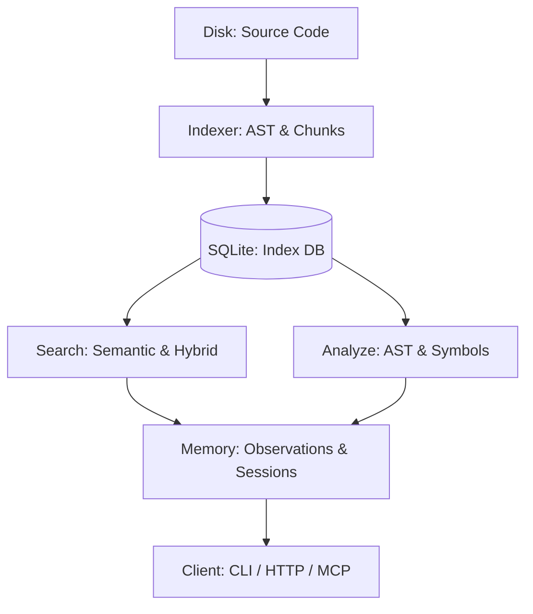

<p align="center">
  
</p>

# 🧠 CodeIndex

[](https://www.python.org/)
[](LICENSE)
[](pyproject.toml)
[](#architecture)

**CodeIndex** is like a "Search Engine & Memory" for your software code. It lives entirely on your own computer, keeping your data private while making your code understandable for AI tools.

### 🌟 What does it actually do?
Imagine your code is a massive library with thousands of books.
- **The Search Problem**: Normally, if you ask an AI "How do I log in?", it has to guess where to look. It's like a librarian who has never seen your library before.
- **The CodeIndex Solution**: CodeIndex builds a digital map of your entire library.
  - **🔍 Smart Search**: You can ask questions in plain English ("Where is the payment logic?"), and it finds the exact spot immediately.
  - **🧠 It Remembers**: It keeps a record of what you've found or analyzed before, so the AI doesn't forget context halfway through a project.
  - **💻 100% Local**: Everything happens on *your* machine. No code is ever sent to a third-party server for indexing.


---

## 📑 Table of Contents
- [✨ Core Philosophy](#-core-philosophy)
- [🚀 Key Features](#-key-features)
- [📦 Installation](#-installation)
- [🛠️ Quick Start](#-quick-start)
- [🏗️ Architecture](#-architecture)
- [🔍 Deep Intelligence (Analyze)](#-deep-intelligence-analyze)
- [🧠 Persistent Memory](#-persistent-memory)
- [🌐 Integration (API & MCP)](#-integration-api--mcp)
- [🧪 Testing](#-testing)
- [🗺️ Roadmap](#-roadmap)

---

### 100% Local & Private
- **Zero-Latency Embeddings**: Uses a deterministic local hash-based embedding engine.
- **Zero Cost**: No external API calls or token fees for indexing.
- **Hardware Agnostic**: Optimized for CPU performance (including Apple Silicon). No GPU required.
- **Local Sovereignty**: Everything happens on your machine via SQLite and `sqlite-vec`.


---

## 🚀 Key Features

### 🔍 Semantic & Hybrid Search
- **Local Vectors**: Powered by `sqlite-vec` or `sqlite-vss` for blazing-fast local similarity search.
- **Hybrid Mode**: Combines semantic meaning with exact symbol matching to ensure "find auth logic" works as well as "find `LoginController`".
- **Compact Snippets**: Returns context-stripped results to maximize token efficiency for LLM prompts.

### ⚡ Professional Code Intelligence (`analyze`)
Go beyond simple grep. Use the integrated analysis engine to query:
- **Multi-Language AST**: Deep structural analysis for Python, JavaScript, TypeScript, Go, Rust, Java, C, and C++ (powered by Tree-sitter).
- **Dependency Graphs**: Map imports and relationship chains across files.
- **Complexity Metrics**: Identify technical debt and hotspots automatically.
- **Usage Scanning**: Find every reference to a symbol across the entire repo.

### 💾 Persistent Project Memory
The `memory_*` subsystem records your development journey.
- **Session Tracking**: Organize work into coherent sessions for long-running feature implementations.

### 🗺️ Cognitive Code Map (Visualizer)
The `viewer` subsystem provides a rich, interactive dashboard for your codebase.
- **Force-Directed Graph**: Visualize the relationships between files, symbols, and citations.
- **Semantic Playground**: Test your RAG queries in real-time and see exactly which parts of your code are being referenced.
- **Real-time Activity**: Monitor background indexing and memory capture via a live event stream.


---

## 📦 Installation

### Requirements
- Python `3.10` or higher
- Windows, macOS, or Linux

### Setup
```bash
# Create and activate environment
python -m venv .venv
source .venv/bin/activate  # Or .venv\Scripts\Activate.ps1 on Windows

# Install core package
pip install -e .

# Install analysis dependencies (recommended)
pip install -e ".[analysis]"
```

---

## 🛠️ Quick Start

### 1. Initialize and Sync
Initialize your project and perform the first indexing pass.
```bash
codeindex init --path . --workspace my-project
codeindex sync --watch
```

### 2. Powerful Querying
```bash
# Semantic search
codeindex query "how is user authentication handled?" --mode hybrid

# Deep AST analysis
codeindex analyze ast --node-type ClassDef --name-contains Controller
```

### 3. Start the Intelligence Server
Expose all tools to your favorite AI agent via MCP.
```bash
codeindex serve --port 9090
```

---

## 🏗️ Architecture

CodeIndex is built as a modular pipeline that moves code from disk to an actionable memory layer.



- **Storage**: `.codeindex/index.db` (SQLite + Vectors)
- **Core modules**:
  - `indexer.py`: File system synchronization and AST parsing.
  - `storage.py`: Single-file SQLite interface for portability.
  - `memory_service.py`: Orchestrates the persistent memory lifecycle.

---

## 🔍 Deep Intelligence (Analyze)

The `analyze` command is the "scalpel" of CodeIndex. 

| Command | Purpose | Edge Case / Power Tip |
| :--- | :--- | :--- |
| `files` | List tracked project files | Use `--limit` to avoid flooding stdout. |
| `ast` | Query Python AST nodes | Filter by `node-type` or `name-contains`. |
| `symbols` | Extract signatures & docs | Perfect for generating "symbol maps" for agents. |
| `usage` | Find cross-file references | Essential for refactoring impact analysis. |
| `stats` | Project summaries | See language distribution and symbol counts. |

---

## 🧠 Persistent Memory

When you use CodeIndex, it remembers. This keeps the AI "on track" by providing a history of discovered facts.

- **Observations (`obs_...`)**: Discrete facts extracted during search.
- **Citations (`cit_...`)**: Direct links to source code backing up observations.
- **Layers**:
  - `Summary`: High-level context (low tokens).
  - `Expanded`: Detailed snippets.
  - `Full`: The complete raw observation.

---

CodeIndex ships with a full **Model Context Protocol (MCP)** implementation. This allows LLMs (like Claude Desktop or custom agents) to use CodeIndex as a toolset.

### Claude Desktop Integration
Add this to your `claude_desktop_config.json`:

```json
{
  "mcpServers": {
    "codeindex": {
      "command": "python",
      "args": [
        "-m",
        "codeindex.cli",
        "serve",
        "--port",
        "9090"
      ]
    }
  }
}
```

**MCP Toolset includes:**
- `codeindex_search`: Search the codebase semantically.
- `codeindex_analyze`: Run deep structural analysis.
- `codeindex_memory_status`: Check what the project currently remembers.
- `codeindex_memory_search`: Retrieve past findings.

---

## 🧪 Testing

We value stability. Our test suite covers CLI, HTTP, and internal logic.
```bash
pytest
```
*Current test coverage includes incremental sync, memory persistence, and MCP tool serialization.*

---

- [x] **Web UI**: A unified dashboard for browsing the Index and Memory layers (Completed in v0.0.3).
- [ ] **Git Integration**: Automatically respect `.gitignore` and prioritize recently changed files.
- [ ] **Context Pruning**: AI-driven importance scoring for memory entries.


---

CodeIndex is released under the [MIT License](LICENSE).


---
<p align="center">
  Built with ❤️ for the AI Generation of Developers.
</p>
